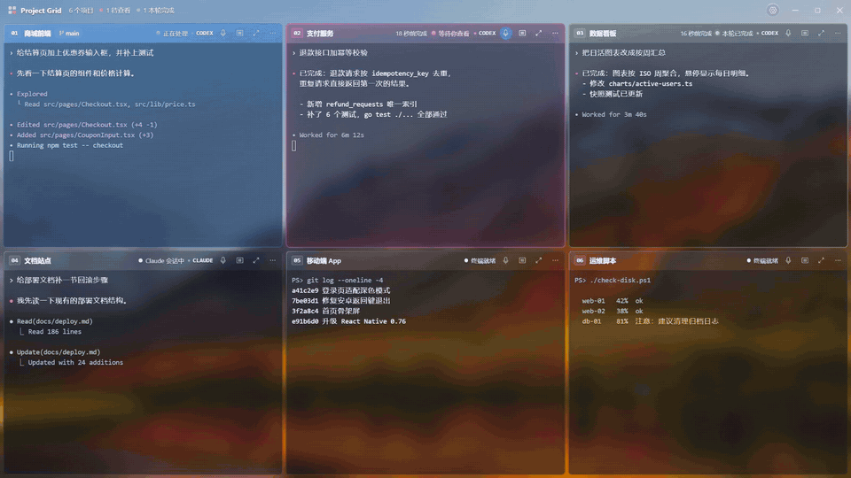
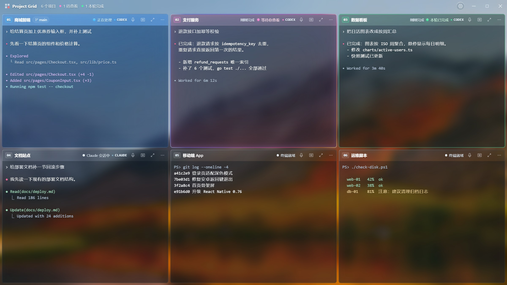
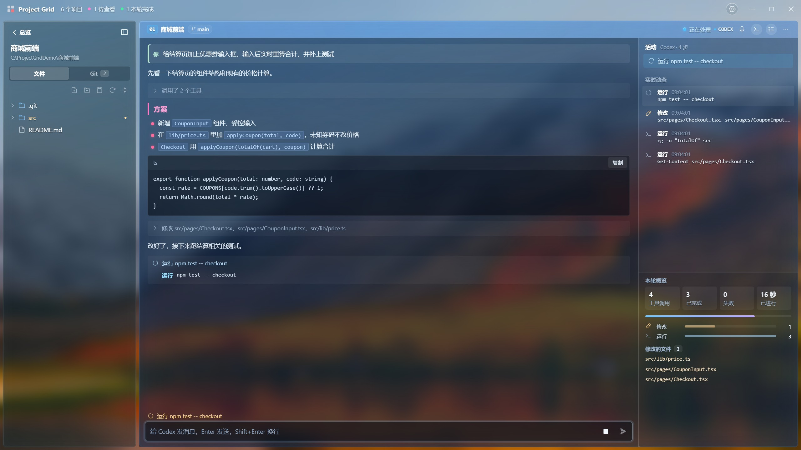
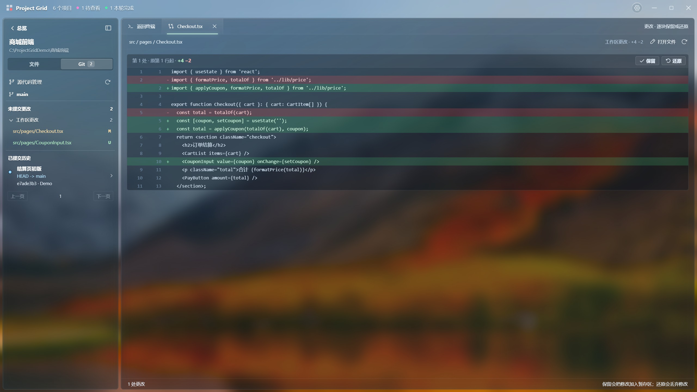
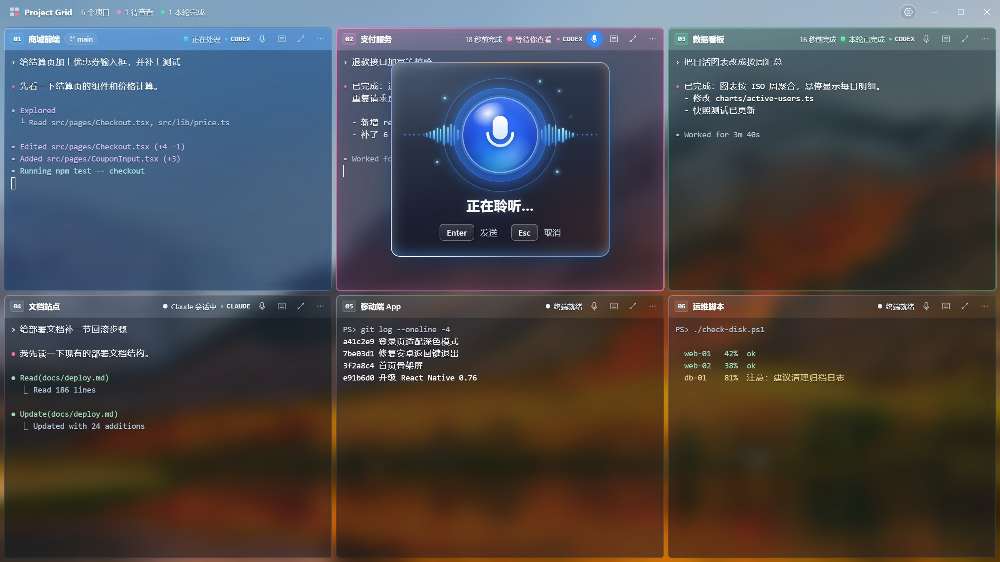

<p align="center">
  
</p>

<h1 align="center">Project Grid</h1>

<p align="center"><strong>Run Codex and Claude Code on six projects at once. Come back only when one of them needs you.</strong></p>
<p align="center">A Windows workspace built for parallel AI coding agents: every project on one screen, and at a glance you know which one is working, which one is done and which one is waiting for you.</p>

<p align="center">
  <a href="https://github.com/noeigenstate/project-grid/releases/latest"></a>
  <a href="https://github.com/noeigenstate/project-grid/releases"></a>
  
  
</p>

<p align="center">
  <a href="https://github.com/noeigenstate/project-grid/releases/latest"><strong>⬇️ Download for Windows</strong></a> ·
  <a href="#why">Why</a> ·
  <a href="#highlights">Highlights</a> ·
  <a href="#get-started">Get started</a> ·
  <a href="README.md">中文</a>
</p>

<p align="center">
  
</p>
<p align="center"><sub>The real app with demo projects (the interface is also available in English). Blue means working; pink breathing means a round is done and waiting for you.</sub></p>

## Why

An AI coding agent takes minutes per round. Watching one project is a waste of your time; juggling five windows means you miss things: a task that finished ten minutes ago, or an agent stuck on a question nobody answered.

**Project Grid puts each project in a card.** Each card is a real terminal running Codex CLI or Claude Code. Give an instruction, go do something else, and the cards tell you how things stand:

- 🔵 **The whole pane turns blue**: working, leave it be
- 🩷 **Pink breathing glow and a spoken notice**: this round is done, come and look
- 🟢 **Steady green**: seen; ready for your next instruction

No new tool to learn: the terminals run the `codex` and `claude` you already have, with the same keys, colours and interaction.

## Highlights

### 🧩 Every project on one screen



The grid arranges itself as you add projects, and the card under the pointer lifts gently. Drag a header to reorder, expand a card and shrink it back, and the terminal session and any unsent draft stay intact. Split a project into several terminals. Local folders and Linux SSH projects share the same grid.

**Completion alerts you can trust.** State comes from the session records Codex and Claude Code keep themselves, not from guessing how long the terminal has been quiet: a sub-agent finishing doesn't count, a command exiting doesn't count; only the end of the main round does, and each instruction alerts once.

### 📖 Read the conversation, not a character grid



Switch any Claude Code or Codex terminal to a **reading view**: headings, coloured bullets, inline code, code blocks with a Copy button, tool calls folded into one line. The box at the bottom writes straight into the real terminal underneath, and the terminal is one click away.

The **activity pane** lists every step live: files edited, commands run, skills and MCP tools called (with what they are for), and below it an overview of the round: the task, progress, calls of each kind and the files changed.

### ✅ Review the changes hunk by hunk



When a round ends, open a changed file from the Git tab and see it the way `git diff` does: removed lines red, added lines green. **Decide each hunk on its own**: keep it (stage it) or revert it. Unstage what you staged, bring back a deleted file. No context switch, no `git add -p` to remember.

### 🎙️ Speak your instructions, hear the results



Press **Ctrl+T** and talk to the current terminal; Enter sends. Speech recognition runs offline on your machine: **nothing is uploaded** and no API key is needed.

When a round finishes, a natural voice tells you which project finished what. Want something more useful? Have Codex or Claude Code sum up the result in one sentence, or use a cloud model, or a local one through Ollama or vLLM.

### And also

- **Pick up where you left off**: on start, your terminals and Codex / Claude Code sessions come back, and an interrupted task is told to continue.
- **SSH projects**: reuse your VS Code Remote-SSH hosts; terminal, files, Git and previews all go over SSH without copying the project down.
- **Files at hand**: file tree, an auto-saving editor, previews for images, web pages, video and Markdown; `Ctrl+click` a path in the terminal to open it.
- **Beautiful and legible**: a liquid-glass interface with three nature themes; switch to the solid surface for the sharpest text.
- **Chinese and English, rebindable shortcuts, automatic updates**, and an in-app tutorial the first time you open it.

## Get started

**You need:** Windows 10 / 11 (x64), and [Codex CLI](https://github.com/openai/codex) or [Claude Code](https://docs.anthropic.com/claude-code). Not installed yet? Settings › Coding assistants installs either with one click.

1. **Install**: download `Project-Grid-Setup-<version>-x64.exe` from [Releases](https://github.com/noeigenstate/project-grid/releases/latest) (a portable build is there too).
2. **Add projects**: press `Ctrl+Shift+N` and pick one or more folders, or add an SSH project.
3. **Work**: type `codex` or `claude` in a card's terminal, give it a task, and go do something else. Come back when it glows pink.

Switch the interface to English under Settings › Appearance › Language.

<details>
<summary><strong>Keyboard shortcuts</strong> (all rebindable in Settings)</summary>

| Keys | Action |
| --- | --- |
| `Ctrl + Shift + N` | Add a project |
| `Ctrl + Shift + Enter` | Expand or restore the current project |
| `Ctrl + Shift + G` | Back to the overview |
| `Ctrl + Tab` / `Ctrl + Shift + Tab` | Next / previous project |
| `Ctrl + Shift + T` | New split terminal in the current project |
| `Ctrl + T` | Dictate; Enter sends, Esc cancels |
| `Ctrl + Shift + F` | Search projects |
| `Ctrl + B` | Show or hide the file tree |
| `F11` | Full-screen window |
| `Ctrl + ,` | Settings |

</details>

## FAQ

<details>
<summary><strong>Is my code or data uploaded anywhere?</strong></summary>

Project Grid itself **collects nothing and has no telemetry**. It contacts only GitHub (update checks) and Hugging Face or its mirror (a one-time download of the offline voice models). Only if you choose a cloud model to summarise spoken notices is a round's final reply sent to the provider you picked. Codex and Claude Code talk to their own services exactly as they do in any terminal.

</details>

<details>
<summary><strong>How is this different from a few terminals or VS Code?</strong></summary>

The terminals are the same; the difference is that Project Grid **knows what state each agent is in**. It reads the session records of Codex and Claude Code to tell working, done and interrupted apart, and tells you with colour, notifications and voice. Add the reading view, the activity pane and hunk-by-hunk Git review, and it is built for keeping an eye on several AI tasks at once.

</details>

<details>
<summary><strong>macOS or Linux?</strong></summary>

For now, Windows 10 / 11 x64 only. Remote projects can be any Linux server with Python 3.6+ and Bash. macOS and Linux desktop builds are on the roadmap; tell us you want them in [Issues](https://github.com/noeigenstate/project-grid/issues).

</details>

<details>
<summary><strong>Does it change my Codex or Claude Code configuration?</strong></summary>

No. What completion alerts need is passed in when the agent starts and never written to your configuration files; your own hooks and settings keep working.

</details>

More detail on session restore, SSH, previews, spoken notices, and building and releasing is in the [usage guide](docs/usage.md) (Chinese).

## Roadmap

- [ ] Project groups and quick switching
- [ ] Unified alerts for more command-line coding agents
- [ ] A record of each round's results and artifacts
- [ ] macOS / Linux desktop builds, WSL workspaces

Ideas are welcome in [Issues](https://github.com/noeigenstate/project-grid/issues). If Project Grid is useful to you, a ⭐ star helps others find it.

## Development

```powershell
git clone https://github.com/noeigenstate/project-grid.git
cd project-grid
npm ci
npm start              # run in development
npm test               # unit tests
npm run test:desktop   # real desktop interaction tests
npm run dist           # build the installer and portable editions
```

Electron · React · TypeScript · xterm.js · node-pty. Every release passes unit tests, desktop tests against the packaged app and Linux SSH integration tests before it is published. The screenshots and the demo in this README are generated from demo projects by `scripts/readme-shots.mjs`.

---

<p align="center">
  <strong>Let the agents work. Spend your attention where it's needed.</strong><br />
  <a href="https://github.com/noeigenstate/project-grid/releases/latest">Download</a> ·
  <a href="https://github.com/noeigenstate/project-grid/issues">Feedback</a>
</p>
